# 👋 Hi, I'm Hanif

### 👨‍💻 Software Engineer | Laravel & PHP | React & Next.js | Building Scalable Business Applications

I’m a **Software Engineer** with around **5 years of experience** building web applications, backend systems, APIs, and business-focused software.

My primary focus is **PHP & Laravel**, with full-stack experience across **React.js, Next.js, TypeScript, JavaScript, MySQL, PostgreSQL, and modern web technologies**.

I also work with **servers, cloud infrastructure, deployment, Docker, APIs, real-time systems, and third-party integrations**.

I enjoy solving real-world engineering problems and turning complex business requirements into **reliable, maintainable, and scalable software**.

---

## 🚀 What I Do

* 🧩 Build backend applications with **PHP & Laravel**
* 🔌 Design and develop **REST APIs & third-party integrations**
* 🏗️ Build **business applications & SaaS platforms**
* ⚡ Develop **real-time features & notification systems**
* 🗄️ Design and optimize **database structures & queries**
* 🎨 Build modern interfaces with **React.js & Next.js**
* 🔐 Implement authentication, authorization & business workflows
* 📱 Develop APIs for **web & mobile applications**
* ☁️ Deploy and maintain applications on **VPS & cloud infrastructure**
* 🐳 Work with **Docker & production environments**
* 🔧 Manage servers, control panels & application deployments
* 📈 Focus on **performance, scalability & maintainability**

---

# 🛠️ Tech Stack

## 👨‍💻 Backend

**PHP • Laravel • Python • REST APIs • Authentication • Business Logic**

---

## 🎨 Frontend

**JavaScript • TypeScript • React.js • Next.js • Redux • jQuery**

---

## 🎯 UI & Styling

**HTML • CSS • Bootstrap • Tailwind CSS**

---

## 🗄️ Databases

**MySQL • PostgreSQL • Oracle**

---

## ☁️ DevOps, Cloud & Infrastructure

**Docker • VPS • AWS EC2 • DigitalOcean • Cloudflare • Control Panels • Server Deployment**

---

## 🔧 Development & API Tools

**Git • GitHub • GitLab • Postman**

---

## 📋 Project & Team Tools

**Jira • Trello • Asana**

---

# 🧠 Engineering Interests

I’m particularly interested in building systems that are:

* ⚙️ **Maintainable**
* 📈 **Scalable**
* ⚡ **Performant**
* 🔒 **Secure**
* 🔄 **Reliable**
* 🧩 **Well-structured**

I care about more than making a feature work.

I think about the **complete workflow**, including business rules, edge cases, database design, API behavior, user experience, performance, deployment, and how the system behaves in production.

---

## 💼 Business Applications & Domains

I have worked on and contributed to business applications across multiple domains, including:

* 🏫 **School Management Systems**
* 👥 **HRM — Human Resource Management**
* 🤝 **CRM — Customer Relationship Management**
* 🏠 **Landlord & Property Management**
* 🛒 **POS — Point of Sale**
* 📦 **Inventory Management**
* 🛍️ **E-commerce Platforms**
* 🏭 **Manufacturing Management**
* 🏦 **Banking & Loan Management Systems**

---

## ⚙️ Common System Capabilities

Across these applications, I have worked with:

* 🔔 **Notification Systems**
* 📱 **Mobile Application APIs**
* 🔥 **Firebase Push Notifications**
* 🔄 **Complex Business Workflows**
* 🔌 **REST APIs & Third-Party Integrations**
* 🗄️ **Database Design & Optimization**
* 🔐 **Authentication & Authorization**
* 📊 **Reports & Business Analytics**
* 💰 **Payment & Financial Workflows**
* ⚡ **Performance Optimization**
* 🚀 **Production Deployment & Server Management**

---

## 🏢 SaaS & Multi-Tenant Applications

Worked with SaaS architecture and real-world multi-tenancy challenges, including:

* 🏗️ Multi-tenant architecture
* 🗄️ Database architecture
* 🔐 Tenant data isolation
* 📊 Resource management
* ⚡ Performance optimization
* ☁️ Server limitations
* 🚀 Production deployment

I’m particularly interested in understanding the trade-offs between **separate-database and shared-database architectures**.

---

## ⚡ Real-Time Systems

I’m interested in building real-time applications using technologies such as:

**Laravel Events → Laravel Reverb → WebSockets → Laravel Echo → UI**

Useful for:

* 🔔 Real-time notifications
* 📊 Live dashboards
* 🔄 Status updates
* 👥 User activity
* ⚙️ Background process updates

---

# 📈 Currently Learning & Improving

I’m continuously improving my knowledge in:

* 🏗️ System Design
* 🧩 Software Architecture
* ⚡ Advanced Laravel
* 🗄️ Database Optimization
* 🌐 Distributed & Real-Time Systems
* ☁️ Cloud Infrastructure
* 🐳 DevOps & Docker
* 🤖 AI-powered Applications
* 📈 Application Scalability

---

# 📊 GitHub Stats

---

# 📫 Let's Connect

---

## 💡 How I Think About Software

> **A feature can work perfectly while the workflow is completely wrong.**

Good software isn't just about writing code that works.

It's about understanding the **problem, business rules, workflow, edge cases, architecture, performance, and real-world behavior** behind that code.

---

### 🚀 Build • Learn • Improve • Repeat

⭐ Feel free to explore my repositories and projects.

